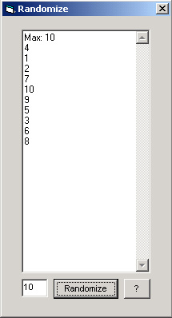



## RandomizeNumber

### Description

Created Unique Randomized Numbers.

This program can be used to create a random number based on the maximum number that you want (default is 10).

It can also be implemented for a lotery program and random examination program.

As a beginner, the algorithm number used might be wrong or inefficient. Therefore if you have any suggestion for the better, please feel free to inform me, Any suggestion/ advice would be greatly appreciated

Thank you.
 
### More Info
 
MaxNumber

This program can be used to create a random number based on the maximum number that you want (default is 10).

It can also be implemented for a lotery program and random examination program.

As a beginner, the algorithm number used might be wrong or inefficient. Therefore if you have any suggestion for the better, please feel free to inform me, Any suggestion/ advice would be greatly appreciated

Thank you.

Unique Randomize Numbers

             |
---                |---
**Submitted On**   |2002-12-17 22:30:02
**By**             |[Willy Marlian](https://github.com/Planet-Source-Code/PSCIndex/blob/master/ByAuthor/willy-marlian.md)
**Level**          |Beginner
**User Rating**    |5.0 (10 globes from 2 users)
**Compatibility**  |VB 6\.0
**Category**       |[Math/ Dates](https://github.com/Planet-Source-Code/PSCIndex/blob/master/ByCategory/math-dates__1-37.md)
**World**          |[Visual Basic](https://github.com/Planet-Source-Code/PSCIndex/blob/master/ByWorld/visual-basic.md)
**Archive File**   |[RandomizeN15150912172002\.zip](https://github.com/Planet-Source-Code/willy-marlian-randomizenumber__1-41677/archive/master.zip)

